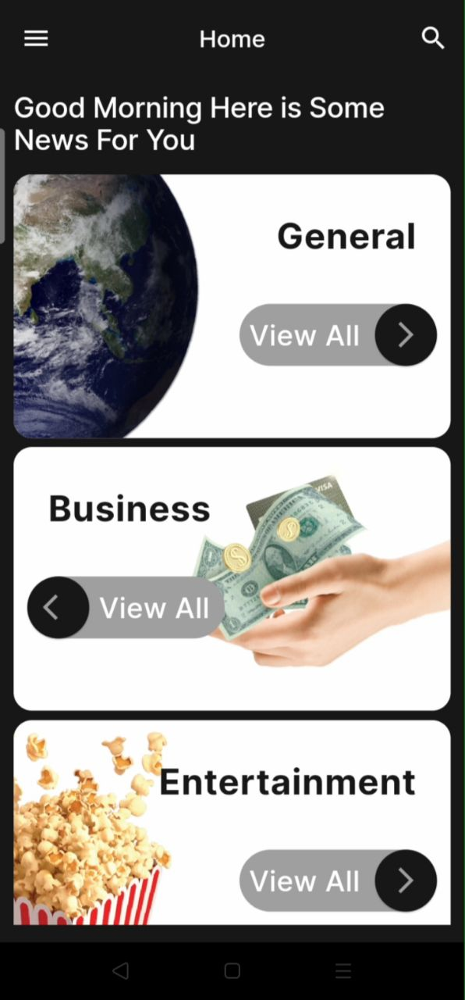
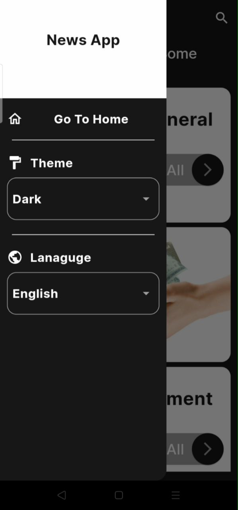
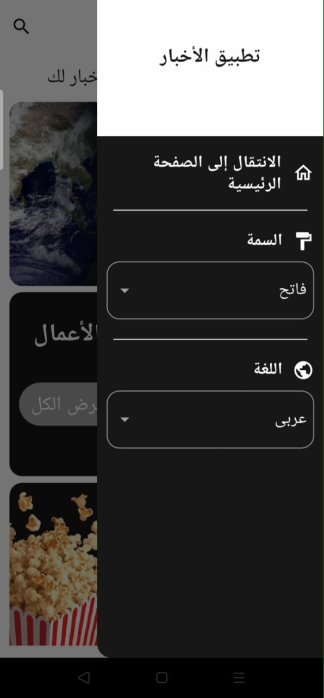
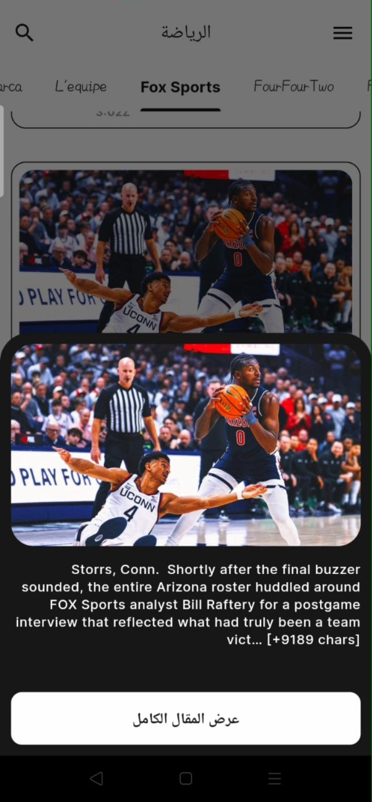
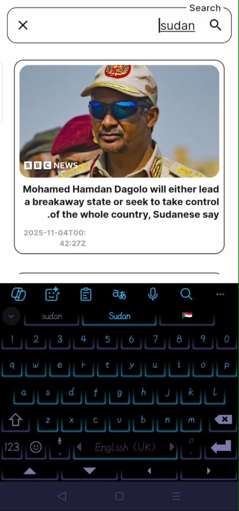

# News App

A modern and feature-rich Flutter news application that fetches real-time news from the News API, providing a smooth and elegant user experience.

## Features

- **Splash Screen**: A beautiful welcome screen displayed when launching the app.
- **News Categories**: Browse news by various categories (Sports, Technology, Health, etc.).
- **Sources Tabs**: View articles from multiple news sources within each category using interactive TabBar.
- **Article Details**: Tap any article to open a Bottom Sheet showing the description and image, with a button to view the full article in the browser.
- **Global Search**: Search for news articles using keywords across all sources.
- **Light & Dark Themes**: Toggle between light and dark modes with persistence via Shared Preferences.
- **Bilingual Support**: Full support for English and Arabic (including RTL layout).
- **Responsive Design**: Built with `flutter_screenutil` for perfect adaptation to all screen sizes.
- **Navigation Drawer**: Side drawer with options to return home and change theme/language settings.
- **Efficient Image Loading**: Uses `cached_network_image` for smooth loading and caching of images.
- **Clean Architecture**: Implements core principles of Clean Architecture (separation of Data, Repository, ViewModel, and UI layers) with Provider for state management.

## Tech Stack & Packages

- **Flutter** – UI framework
- **Provider** – State management
- **flutter_screenutil** – Responsive design
- **cached_network_image** – Efficient image loading
- **http** – API requests
- **dartz** – Functional error handling (Either)
- **google_fonts** – Custom typography
- **url_launcher** – Open full articles in browser
- **shared_preferences** – Persist theme and language settings
- **flutter_localizations** – Internationalization support

## 📸 Screenshots

  
  
  
  
  
  
  
  
  
  
  
  

## API Used

- **News API**
- Sources endpoint: `/v2/top-headlines/sources`
- Articles endpoint: `/v2/everything`

> Note: The API key is currently hardcoded in `api_service.dart`. In production, move it to environment variables or secure storage.

